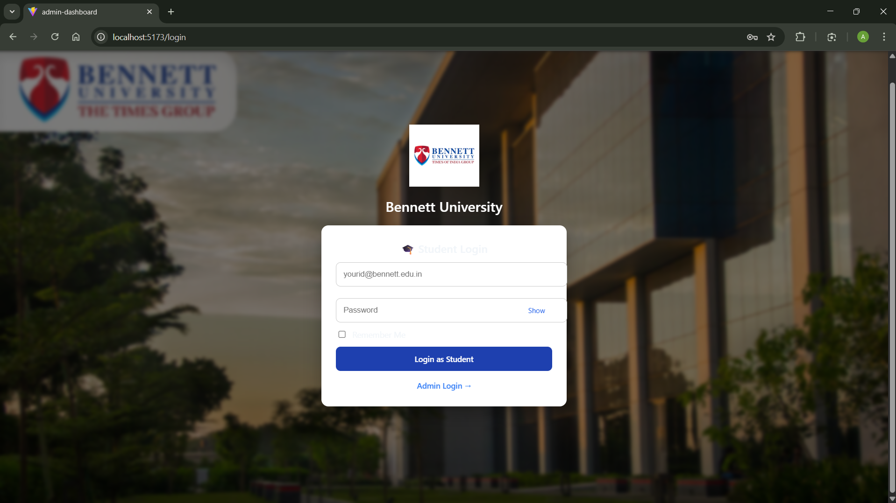
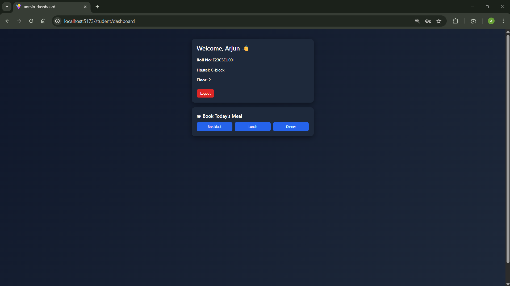
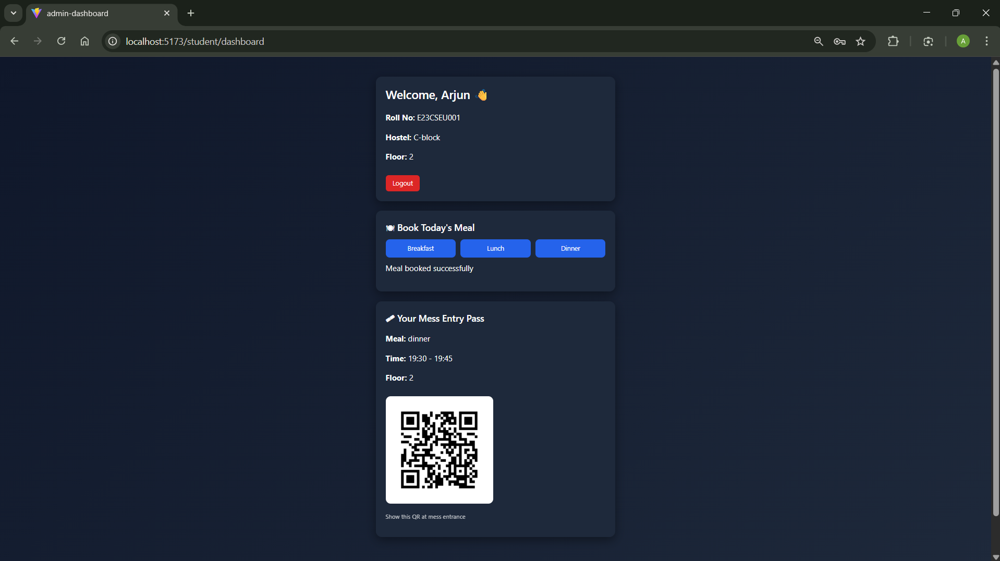
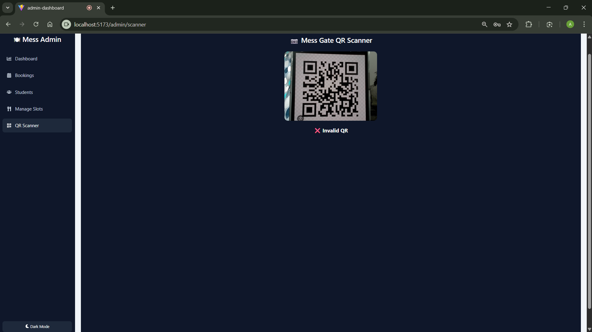

# Mess Slot Booking System

A full-stack university mess management system that allows students to book meal slots and enables administrators to manage students, meal timings, and analytics.

🔗 Built as a real-world campus automation project.

---

##  Key Features

###  Student Panel
- Secure student login (college email based)
- Book mess slots (Breakfast, Lunch, Dinner)
- Prevent double bookings
- View booking history
- QR-based meal verification system

### Admin Panel
- Secure admin login
- Create & manage meal slots
- View all student bookings
- Manage registered students
- Daily mess usage analytics
- QR Scanner for attendance

---

## System Workflow

1. Students log in using university email  
2. Students book available meal slots
3. Slot gets selected to the nearest slot available automatically for the selected meal
4. Admin monitors bookings in real time  
5. QR codes are used to verify entry  
6. Analytics dashboard shows meal statistics

---
## 📸 Screenshots

### Student Login


### Student Dashboard


### Student Meal QR


### Admin QR Scanner



##  Tech Stack

| Layer | Technology |
|------|------------|
| Frontend | React + Vite |
| Backend | Node.js + Express |
| Database | MongoDB Atlas |
| Authentication | JWT |
| Styling | CSS |
| Tools | Git, GitHub |

---

## ⚙️ Installation Guide

### 1️⃣ Clone Repository

```bash
git clone https://github.com/arjunnvarshney/mess-slot-booking.git
cd mess-slot-booking
```

---
# API Documentation

Base URL (local):
http://localhost:5000/api


---

### Register Admin  
**POST** `/admin/register`

**Request Body**
```json
{
  "username": "admin",
  "password": "password123"
}
```

**Success Response**
```json
{
  "message": "Admin registered successfully"
}
```

---

### Admin Login  
**POST** `/admin/login`

Authenticates admin and returns a JWT token.

**Request Body**
```json
{
  "username": "admin",
  "password": "password123"
}
```

**Success Response**
```json
{
  "message": "Admin login successful",
  "token": "jwt_token_here"
}
```

---

### Get Logged-in Admin  
**GET** `/admin/me`  
Requires Admin Token

**Headers**
```json
{
  "Authorization": "Bearer <JWT_TOKEN>"
}
```

**Success Response**
```json
{
  "message": "Admin authenticated",
  "admin": {
    "id": "admin_id",
    "username": "admin"
  }
}
```


